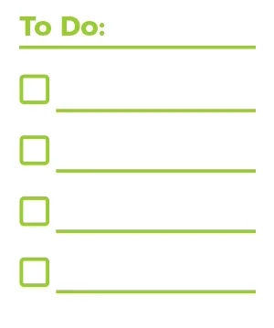

# "To-do" or not "To-do" !!!

For this project, I create a online to-do list app using React. This app will manage state and local storage to keep track of data. 

# Skills I will showcase:

        - React Fundamental: 
                - React Render
                - Classes
                - React Lifecycle

        - Design patterns
                - Parent and child relationship

